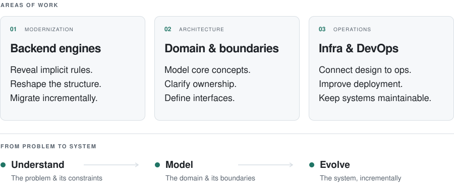

## Jae

**Backend Engineer** · System Architecture & Modernization

I make complex systems easier to understand, change, and extend.

[Portfolio ↗](https://jae-heo.github.io/portfolio/en/) &nbsp; / &nbsp; [Writing ↗](https://jae-heo.github.io/tech/en/)

 

<picture>
  <source media="(max-width: 767px) and (prefers-color-scheme: dark)" srcset="assets/focus-mobile-dark.svg">
  <source media="(max-width: 767px) and (prefers-color-scheme: light)" srcset="assets/focus-mobile-light.svg">
  <source media="(prefers-color-scheme: dark)" srcset="assets/focus-dark.svg">
  
</picture>

 

  
More about my work

I modernize existing systems by uncovering implicit rules, extracting core domain concepts, and redesigning interfaces. The goal is to reduce recurring engineering costs and create structures that other engineers can extend.

My work spans backend engines, infrastructure, and DevOps. I value clear ownership, high engineering standards, and learning alongside people who challenge each other to grow.

I'm interested in working closer to users and customers, connecting their problems to domain models and bringing those insights back into product architecture.

