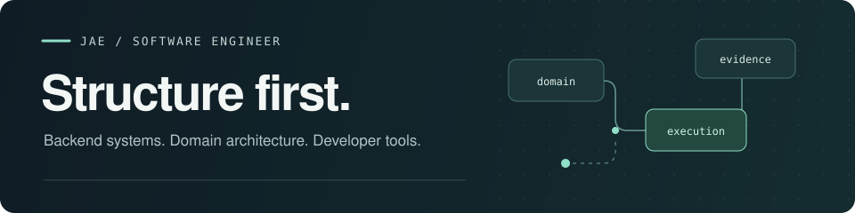

  

# Hi, I'm Jae.

I'm **Jaeyoung Heo**, a software engineer working on **backend systems, domain architecture, and developer tools**.

I like making complex rules explicit, execution predictable, and systems easier to understand. My work spans runtime tooling, deterministic simulation, and the small tools I use every day.

[Portfolio](https://jae-heo.github.io/portfolio/en/) · [Technical writing](https://jae-heo.github.io/tech/en/) · [한국어 포트폴리오](https://jae-heo.github.io/portfolio/ko/)

### Selected work

| Project | What it does | My work |
| --- | --- | --- |
| **[Jelly](https://github.com/jae-heo/jelly)** | A web terminal for your own servers, with persistent sessions across desktop and mobile. | Personal project · TypeScript, React, Node.js, tmux |
| **[Neurorca](https://github.com/jae-heo/orca/tree/local/neurorca)** | An integration build of [Orca](https://github.com/stablyai/orca), with headless SSH workflows and database tabs. | Custom integration fork · TypeScript, Electron |
| **[Collision prediction](https://github.com/jae-heo/collision-prediction-system)** | A single-camera system for real-time collision warnings. | Team project · Frontend and server development |

### How I build

- **Model the domain.** Make constraints and ownership visible in the code.
- **Make execution explicit.** Use clear ordering and trial, commit, and rollback boundaries.
- **Measure before changing.** Let profiles, traces, and regression checks guide the work.

### On my desk

Persistent terminal sessions, deterministic simulation in Rust, and notes on Python internals, compilers, and Linux.

한국어로 소개

안녕하세요, 허재영입니다. 복잡한 도메인을 명시적이고 검증 가능한 구조로 풀어내는 소프트웨어 엔지니어입니다.

백엔드 시스템과 실행 구조를 설계하고, 직접 쓰는 개발 도구를 만듭니다. 도메인의 의미를 코드에 남기고, 실행 순서와 상태의 소유권을 분명하게 드러내는 작업에 관심이 있습니다.

[포트폴리오](https://jae-heo.github.io/portfolio/ko/) · [기술 블로그](https://jae-heo.github.io/tech/ko/)

